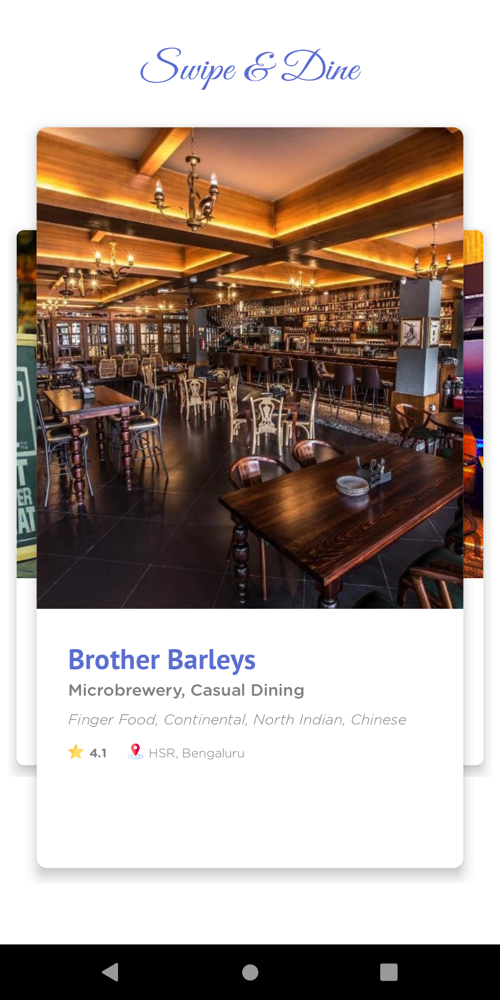

# CustomHorizontalViewPager_Restaurant_App


# Ever tried a swipe to find your favourite restaurant ? Why do a swipe only for dating.

# Swipe & Dine 
  This is a new way to find your favourite restaurant, just swipe right to see new restaurants 
  and better is that you can even "swipe back left" to see any restaurant if you missed! 
  
  Click on the card to view more more photos, information about the restaurant and check out new upcoming events!


  
 Now, let's see how was this app made ? 
 
 Customized the below library to design the view for swipe.
 
 ```
   //------------- Viewpager ----------------
   implementation 'com.github.devlight:infinitecycleviewpager:1.0.2'
 ```
 
 Use this in your xml file :
 
  ```
    <!-- Viewpager layout -->
    <com.gigamole.infinitecycleviewpager.HorizontalInfiniteCycleViewPager
        android:id="@+id/horizontalViewPager"
        android:layout_width="match_parent"
        android:layout_height="match_parent"
        android:layout_marginTop="@dimen/dim_35"
        android:layout_marginBottom="@dimen/dim_15"
        app:icvp_interpolator="@android:anim/accelerate_decelerate_interpolator"
        app:icvp_scroll_duration="250"
        app:icvp_center_page_scale_offset="@dimen/dim_30"
        app:icvp_min_page_scale_offset="@dimen/dim_7"
        app:icvp_max_page_scale="0.9"
        app:icvp_min_page_scale="0.65"
        app:icvp_medium_scaled="false"/>
     
   ``` 
   
   
   
   Create a PagerAdapter to develop the ui for each item inside a ViewPager (Restaurant Swipe Card) :
   
   ``` 
   class DemoHorizontalPagerAdapter(var context: Context, var restaurantList: List<Restaurant>,
    private val onItemClickListener: (teamData: Restaurant) -> Unit) : PagerAdapter() {

    override fun isViewFromObject(view: View, p1: Any): Boolean {
        return view == p1
    }

    override fun getCount(): Int {
        return restaurantList.size
    }

    override fun destroyItem(container: ViewGroup, position: Int, `object`: Any) {
        container.removeView(`object` as View)
    }

    override fun instantiateItem(container: ViewGroup, position: Int): Any {
        val view = LayoutInflater.from(context)
            .inflate(R.layout.layout_horizontal_vp_item, container, false)
        setupLayout(view, restaurantList[position])
        container.addView(view)
        return view
    }

    /* Set UI on pager item */
    private fun setupLayout(view: View, restaurant: Restaurant) {
        view.apply {

            name_tv.text = restaurant.name
            desc_tv.text = restaurant.desc
            rating_tv.text = restaurant.ratings.toString()
            location_tv.text = restaurant.location

            if (!TextUtils.isEmpty(restaurant.cuisine)) {
                cuisine_tv.text = """${restaurant.cuisine.capitalize()}"""
            }

            if (!TextUtils.isEmpty(restaurant.restaurantProfileImage)) {

                val options: RequestOptions = RequestOptions()
                    .placeholder(R.drawable.rest_placeholder_image)
                    .error(R.drawable.rest_placeholder_image)
                    .diskCacheStrategy(DiskCacheStrategy.ALL)

                Glide.with(context).load(restaurant.restaurantProfileImage)
                    .apply(options)
                    .into(restaurant_profile_imageView)
            }


            view.setOnClickListener {
                onItemClickListener(restaurant)
            }

        }
    }

    override fun getItemPosition(`object`: Any): Int {
        return POSITION_NONE
    }


}
```    

To design the restaurant card :
```
<?xml version="1.0" encoding="utf-8"?>
<androidx.coordinatorlayout.widget.CoordinatorLayout xmlns:android="http://schemas.android.com/apk/res/android"
    xmlns:app="http://schemas.android.com/apk/res-auto"
    android:layout_width="match_parent"
    android:layout_height="match_parent">

    <FrameLayout
        android:layout_width="match_parent"
        android:layout_height="match_parent">

        <!-- Card layout -->
        <androidx.cardview.widget.CardView
            android:layout_width="match_parent"
            android:layout_height="match_parent"
            android:layout_gravity="center"
            app:cardBackgroundColor="@android:color/white"
            app:cardCornerRadius="@dimen/dim_10"
            app:cardElevation="@dimen/dim_8"
            app:cardPreventCornerOverlap="true"
            app:cardUseCompatPadding="true">

            <!-- Main layout -->
            <androidx.constraintlayout.widget.ConstraintLayout
                android:layout_width="match_parent"
                android:layout_height="match_parent">

                <!-- Restaurant Profile Image -->
                <ImageView
                    android:id="@+id/restaurant_profile_imageView"
                    android:layout_width="match_parent"
                    android:layout_height="0dp"
                    android:scaleType="centerCrop"
                    app:layout_constraintHeight_percent="0.65"
                    app:layout_constraintTop_toTopOf="parent" />

                <!-- Restaurant Info bottom layout -->
                <LinearLayout
                    android:id="@+id/bottom_layout"
                    android:layout_width="match_parent"
                    android:layout_height="wrap_content"
                    android:layout_marginTop="@dimen/dim_30"
                    android:orientation="vertical"
                    android:paddingStart="@dimen/dim_30"
                    app:layout_constraintTop_toBottomOf="@id/restaurant_profile_imageView">

                    <!-- Name -->
                    <TextView
                        android:id="@+id/name_tv"
                        android:layout_width="wrap_content"
                        android:layout_height="wrap_content"
                        android:ellipsize="end"
                        android:fontFamily="@font/pt_sans_bold"
                        android:maxLines="1"
                        android:textColor="@color/color_5B6FD0"
                        android:textSize="@dimen/sp_27" />

                    <!-- Desc -->
                    <TextView
                        android:id="@+id/desc_tv"
                        android:layout_width="wrap_content"
                        android:layout_height="wrap_content"
                        android:layout_marginTop="@dimen/dim_5"
                        android:fontFamily="@font/gotham_rounded_medium"
                        android:includeFontPadding="false"
                        android:textColor="@color/color_808080"
                        android:textSize="@dimen/sp_16" />

                    <!-- Cuisine -->
                    <TextView
                        android:id="@+id/cuisine_tv"
                        android:layout_width="wrap_content"
                        android:layout_height="wrap_content"
                        android:layout_gravity="center_vertical"
                        android:layout_marginTop="@dimen/dim_10"
                        android:layout_marginEnd="@dimen/dim_20"
                        android:ellipsize="end"
                        android:fontFamily="@font/gotham_rounded_light_italic"
                        android:gravity="center_vertical"
                        android:maxLines="4"
                        android:textColor="@color/color_808080"
                        android:textSize="@dimen/sp_14" />

                    <LinearLayout
                        android:layout_width="wrap_content"
                        android:layout_height="wrap_content"
                        android:orientation="horizontal"
                        android:layout_marginTop="@dimen/dim_15">

                        <!-- rating Icon -->
                        <ImageView
                            android:id="@+id/rating_icon"
                            android:layout_width="@dimen/dim_15"
                            android:layout_height="@dimen/dim_15"
                            android:src="@drawable/star_icon" />

                        <!-- rating text -->
                        <TextView
                            android:id="@+id/rating_tv"
                            android:layout_width="wrap_content"
                            android:layout_height="wrap_content"
                            android:layout_gravity="center_vertical"
                            android:layout_marginStart="@dimen/dim_5"
                            android:fontFamily="@font/gotham_rounded_bold"
                            android:gravity="center_vertical"
                            android:textColor="@color/color_808080"
                            android:textSize="@dimen/sp_12" />

                        <!-- location Icon -->
                        <ImageView
                            android:id="@+id/location_icon"
                            android:layout_width="@dimen/dim_15"
                            android:layout_height="@dimen/dim_15"
                            android:src="@drawable/location_icon"
                            android:layout_marginStart="@dimen/dim_20"/>

                        <!-- location text -->
                        <TextView
                            android:id="@+id/location_tv"
                            android:layout_width="wrap_content"
                            android:layout_height="wrap_content"
                            android:layout_gravity="center_vertical"
                            android:layout_marginStart="@dimen/dim_5"
                            android:fontFamily="@font/gotham_rounded_light"
                            android:gravity="center_vertical"
                            android:textColor="@color/color_808080"
                            android:textSize="@dimen/sp_12" />

                    </LinearLayout>

                </LinearLayout>

            </androidx.constraintlayout.widget.ConstraintLayout>

        </androidx.cardview.widget.CardView>

    </FrameLayout>

</androidx.coordinatorlayout.widget.CoordinatorLayout>

```

   
   
   
   
   


# Credits

https://github.com/Devlight/InfiniteCycleViewPager 
https://github.com/Baseflow/InfiniteCycleViewPagerXamarin


